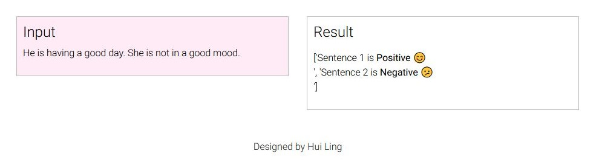

# Sentiment Analysis

A simple Flask application to detect sentiment from text. 

<b> Model: </b> <a href='https://stanfordnlp.github.io/stanza/sentiment.html' target='_blank'>Stanza</a>

<b>Demo:</b> 

 

 

<b>Created By:</b> Hui Ling

